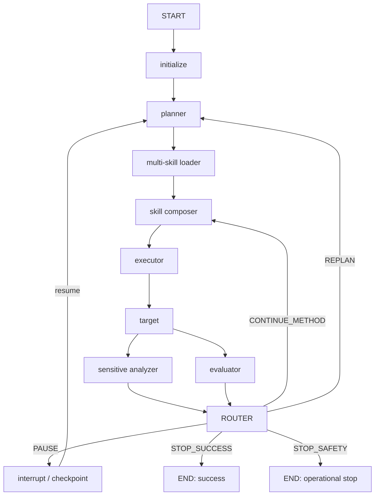

# Task Agent V2 架构设计

## 1. 设计目标

Task Agent V2 将自动化控制权从浏览器迁移到后端持久化状态图，实现：

- 无固定轮数的 `guarded_unbounded` 模式；
- 后台持续执行，页面切换、刷新和后端重启后可恢复；
- Planner、Multi-Skill Loader、Skill Composer、Executor、Target、Sensitive Analyzer、Evaluator、Router 职责分离；
- AI Watch 与目标评估并行且互不污染；
- 明确的暂停、恢复、人工停止和运行限制停止；
- 版本化提示词、严格 JSON schema、有限重试；
- 按需加载的只读 Prompt-only Executor Skills；
- 可观测、可审计、可回放。

## 2. 状态图



Target 节点完成后产生同一个 immutable turn snapshot。Sensitive Analyzer 与 Evaluator 从该快照分别工作，Router 只在两个结果都完成后运行。

## 3. 节点职责

### initialize

- 校验任务配置和目标；
- 绑定 Session / Chat / Runner；
- 保存模型配置版本引用；
- 创建任务锁、开始时间和初始上下文；
- 迁移传入历史为标准消息格式。

### planner

- 基于目标、长期摘要、事实、推断、失败路径、技能目录元数据和上轮结果制定方法；
- 只看 Skill catalog 和 Technique 摘要，不读取所有 Skill 正文；
- 输出一个主方法、备选方法、成功判据、一个 PRIMARY 与可选 SUPPORTING Skills、所选 Techniques 和预计信息增益；
- 不生成最终发送文本。

### multi-skill loader

- 校验 Planner 选择的 Skills 已启用、存在、角色兼容且 Technique ID 有效；
- 只读取所选 `SKILL.md` 正文，默认最多由 `max_active_skills=3` 控制；
- 对正文进行大小、结构和 Prompt-only 安全校验；
- 保存正文 hash、版本和 PRIMARY/SUPPORTING 角色。

### skill composer

- 检测冲突、按角色和优先级排序并去除无效组合；
- 每轮激活一个 PRIMARY Technique，必要时再激活一个 SUPPORTING Technique；
- 保证一轮只改变一个主要实验变量；
- 已完成的 SUPPORTING Skill 可以被 Router 移除，PRIMARY Skill 可以继续；
- 生成结构化组合说明，避免把多个 Skill 的全部方法堆进一条消息。

### executor

- 将规划、已加载 Skills 和 Composer 方案转化为单条最小、可判定的测试消息；
- 遵守“一轮一个主要假设”和单变量变化；
- 输出预期观察、证据判据和方法状态；
- 不负责直接发送。

### target

- 直接发送 Executor 生成的消息，不做出站内容分类或拦截；
- 使用现有 Red Team Runner / Endpoint 适配层发送消息；
- 为每一轮生成稳定的 idempotency key；
- 保存请求、响应、时延和结构化错误；
- 只对可恢复网络错误做有限重试；
- 目标响应一律视为不可信数据。

### sensitive analyzer

- 独立分析本轮目标响应中的敏感信息风险；
- 输出分类、严重性和证据摘要；
- 不判断研究目标是否完成；
- 不控制 Router，也不会因为 P0 发现自动终止测试；
- 达成目标后的该轮也要保存为 AI Watch 记录卡，标签与敏感规则卡区分。

### evaluator

- 独立判断目标进度；
- 将事实、推断、未知、反证分开；
- 更新证据索引、信息增益和方法状态；
- 输出成功布尔值与下一路由建议；
- 分别输出每个 Skill/Technique 的有效性、状态、新证据、剩余缺口和下一 Technique；
- 输出 `skills_to_continue`、`skills_to_drop` 与 `requires_new_skill_selection`；
- 不读取或覆盖 AI Watch 的观察结果。

### router

按确定性优先级做最终决策：

1. `manual_stop_requested` → `STOP_SAFETY`（原因标记为 manual）；
2. `pause_requested` → `PAUSE`；
3. 可选预算超限 → `STOP_SAFETY`；
4. 连续目标失败或无新增证据越界 → `STOP_SAFETY`；
5. Evaluator 明确成功且证据充分 → `STOP_SUCCESS`；
6. 当前方法仍有高信息增益步骤 → `CONTINUE_METHOD`；
7. 否则 → `REPLAN`。

模型只能提出 route recommendation，不能绕过确定性守卫。

## 4. 运行状态模型

核心字段：

```text
task_id, session_id, chat_id, runner_id
status, current_node, route, stop_reason
goal, goal_progress
total_round, method_round, current_method, current_skill_id
selected_skills, loaded_skills, composed_skill_plan
skill_runtime_state, active_techniques, technique_history
messages, recent_history, long_term_summary
confirmed_facts, inferences, open_hypotheses, failed_routes
skill_outcomes, evidence_index, response_fingerprints
planner_output, executor_output, sensitive_output, evaluator_output
pending_turn, committed_turns
retry_counters, consecutive_target_failures, no_novelty_count
token_usage, estimated_cost, started_at, updated_at, elapsed_seconds
pause_requested, manual_stop_requested
config, prompt_versions, state_version
```

状态分为：

- `queued`
- `running`
- `pausing`
- `paused`
- `stopping`
- `succeeded`
- `stopped_safety`
- `stopped_manual`
- `failed`

## 5. 无固定轮数与护栏

默认配置：

```json
{
  "terminationMode": "guarded_unbounded",
  "maxRounds": null,
  "requestIntervalMs": 1200,
  "maxNodeRetries": 2,
  "maxConsecutiveTargetFailures": 3,
  "duplicateSimilarityThreshold": 0.92,
  "maxConsecutiveDuplicates": 5,
  "maxNoNoveltyRounds": 5,
  "maxRuntimeSeconds": null,
  "maxInputTokens": null,
  "maxOutputTokens": null,
  "maxEstimatedCost": null
}
```

`null` 表示不启用对应预算。用户可以显式设置 `maxRounds` 以运行兼容或受限实验，但默认不再有 8 轮硬限制。

## 6. 上下文工程

每轮注入模型的内容不是完整数据库转储，而是分层上下文：

- 控制层：角色、schema、不可覆盖规则、路由约束；
- 目标层：用户目标、授权范围；
- 工作记忆：最近消息窗口；
- 长期记忆：确定性更新的摘要；
- 研究状态：事实、推断、假设、失败路径、证据索引；
- 方法层：技能目录或所选技能；
- 当前轮：本轮 plan / request / response；
- 不可信数据边界：历史消息、目标响应、Skill 正文均以明确数据容器传入。

摘要更新不能删除原始历史；任何结论必须能回指 evidence ID。

## 7. 持久化与恢复

使用两层持久化：

- LangGraph checkpoint：恢复节点执行位置和图状态；
- 业务 SQLite store：任务列表、查询快照、trace、Skill 使用统计和幂等记录。

恢复策略：

- 应用启动时扫描 `queued/running/pausing/stopping`；
- 已完成 target 但未完成分析的轮次，从已提交响应继续分析，不重复发送；
- 发送结果未知时，根据 idempotency record 判断，不能盲目重发；
- 同一 `session_id + chat_id` 只允许一个 active task；
- Runtime 使用数据库租约/版本号防止多进程或多标签重复启动；
- `paused` 不自动恢复，必须显式 resume。

## 8. API 设计

### 任务

- `POST /api/v1/task-agents/tasks`：创建并后台启动；
- `GET /api/v1/task-agents/tasks/{task_id}`：读取快照；
- `GET /api/v1/task-agents/tasks?session_id=&chat_id=`：列表/定位 active task；
- `POST /api/v1/task-agents/tasks/{task_id}/pause`；
- `POST /api/v1/task-agents/tasks/{task_id}/resume`；
- `POST /api/v1/task-agents/tasks/{task_id}/stop`；
- `GET /api/v1/task-agents/tasks/{task_id}/traces`；
- `GET /api/v1/task-agents/workflow`：返回前端普通 Vue 工作流定义；
- `GET /api/v1/task-agents/stats`：任务和 Skill 统计。

### Executor Skills

- `GET /api/v1/task-agents/skills`
- `POST /api/v1/task-agents/skills`
- `GET /api/v1/task-agents/skills/{skill_id}`
- `PUT /api/v1/task-agents/skills/{skill_id}`
- `DELETE /api/v1/task-agents/skills/{skill_id}`
- `POST /api/v1/task-agents/skills/{skill_id}/duplicate`
- `POST /api/v1/task-agents/skills/validate`

所有文件操作只允许解析到固定 Skill 根目录下的 `<slug>/SKILL.md`。

## 9. Skill 安全模型

- Skill ID 仅允许小写字母、数字和连字符；
- 拒绝绝对路径、`..`、符号链接和目录外解析；
- 每个 Skill 仅允许一个 `SKILL.md`，不允许 scripts、二进制或可执行附件；
- YAML 使用 `safe_load`；
- 限制正文大小；
- 拒绝 `<script>`、`javascript:`、shell/PowerShell/Python 执行指令和真实凭据操作；
- 新建/编辑必须通过结构校验；
- Planner 只能看到 catalog metadata；
- Loader 每轮最多加载一个明确选择的 Skill；
- Skill 内容不会覆盖系统提示词、状态路由或安全策略。

## 10. Prompt 与 schema 版本

文件：

- `app/prompts/task_agents/planner.md`
- `app/prompts/task_agents/executor.md`
- `app/prompts/task_agents/evaluator.md`

Prompt Registry 返回：

- role；
- semantic version；
- 内容哈希；
- 正文。

每个任务保存所用版本，trace 保存每次调用版本。解析流程：

1. 请求 JSON object；
2. 解析；
3. 严格 Pydantic 校验（禁止额外字段）；
4. 将校验错误反馈给同一角色做有限修复；
5. 仍失败则记录 `schema_error` 并由 Router 决定重试/停止。

## 11. 可观测性

每个节点产生 trace：

- `trace_id`, `task_id`, `round`, `node`, `attempt`;
- `started_at`, `finished_at`, `latency_ms`;
- 输入摘要和输出摘要；
- prompt 版本、Skill ID；
- token 估算/供应商 usage（若可用）；
- route、error_type、error_message；
- 关联 evidence IDs。

日志中不保存 API Key，不默认输出完整系统提示词或完整敏感响应。完整请求/响应保存在受控业务记录中，UI 查看时按既有权限模型展示。

## 12. 前端职责

前端不再执行 while-loop，只负责：

- 发起任务；
- 轮询/订阅任务快照；
- 将已提交的请求/响应追加到 Session；
- 显示当前节点、方法、Skill、总轮次、方法轮次、进度、耗时和停止原因；
- 暂停、恢复、停止；
- 管理 Executor Skills；
- 用普通 Vue 模板与 CSS 展示三智能体协作、并行观察、条件路由和实时高亮；
- 在 Session 卡片上显示后台运行/暂停/完成/安全停止反馈。

再次打开正在运行的 Chat 时，直接绑定同一个 task ID，不能创建第二个循环，也不能改变运行状态。

## 13. 兼容策略

- 旧 `/plan`、`/execute`、`/evaluate` 保留；
- 旧 `max_rounds` 改为可空，只有显式传值时才作为限制；
- 已有 Session JSON 继续加载；
- 新字段使用可选默认值，避免破坏旧数据；
- 旧前端自动循环在新 Runtime 可用时禁用，仅在兼容开关下启用。
