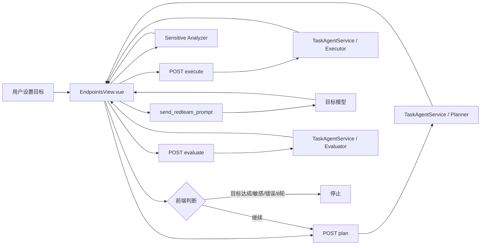

# Task Agent 当前实现分析

> 审计日期：2026-07-24  
> 审计范围：任务规划 Agent、交互执行 Agent、目标评估 Agent、AI Watch 敏感信息分析、前端循环、会话持久化及模型连接配置。

## 1. 结论摘要

当前版本已经具备“规划 → 生成交互文本 → 请求目标模型 → 评估目标 → 继续/停止”的最小闭环，也能在页面内展示目标进度和 AI Watch 结果。但它还不是一个可靠的后台 Agent 编排系统：

- 三个任务 Agent 是三个独立的模型调用角色，并非独立部署的模型实例；它们共同读取当前启用的 AI Settings。
- 自动化循环由 `EndpointsView.vue` 驱动，浏览器页面是实际调度器；后端只提供无状态的 plan / execute / evaluate 单步接口。
- 固定 8 轮上限同时存在于前端常量、请求参数、后端默认值和提示词语义中。
- 会话内容会落盘，但执行位置、节点状态、重试次数、当前方法、预算和停止原因没有后端检查点。
- 页面缓存和刷新恢复只能“尽力续跑”，无法保证 exactly-once；多标签页或重载时可能重复执行一轮。
- 规划、执行、目标评估和敏感信息分析的输出虽使用 JSON，但没有统一的严格 Pydantic 契约和 schema 级修复重试。
- AI Watch 与目标评估是两个不同角色，但当前顺序执行，最终停止逻辑在前端聚合。

因此 V2 应把浏览器调度迁移到后端持久化状态图，并将前端降级为“发起、观察、暂停、恢复、停止”的控制台。

## 2. 当前三个 Agent 的工作原理

### 2.1 任务规划 Agent

位置：`app/services/redteam_task_agent_service.py`

输入：

- 用户目标；
- 完整或裁剪后的聊天历史；
- 当前轮数及最大轮数；
- 上轮评估反馈；
- 已尝试方案等上下文。

行为：

- 通过 `ConnectorAIService` 读取当前启用的 AI 模型配置；
- 将规划系统提示词与结构化上下文发送给模型；
- 期望模型返回 JSON 规划，包括当前策略、具体步骤、成功信号和回退方向；
- 规划结果返回前端，由前端继续调用执行 Agent。

局限：

- 提示词硬编码在 Python 文件中，缺少版本、回滚和独立测试；
- 没有方法库和按需技能加载；
- 没有持久化的假设账本、证据索引和失败路径集合；
- 规划结果只服务当前页面循环，后端不知道任务整体生命周期。

### 2.2 交互执行 Agent

位置：`app/services/redteam_task_agent_service.py`

输入：

- 用户目标；
- 规划 Agent 的方案；
- 聊天历史；
- 当前轮次。

行为：

- 将规划方案转化为一条可直接发送给目标模型的交互文本；
- 返回 JSON，由前端自动填充并发送；
- 自身不直接调用目标模型，也不持有发送状态。

局限：

- 没有独立的 Executor Skill；
- 没有显式的预发送安全节点；
- 没有重复度、单变量实验、最小充分证据等确定性校验；
- 执行文本与规划/历史的动态内容边界不够清晰，存在提示词注入污染控制面语义的风险。

### 2.3 目标评估 Agent

位置：`app/services/redteam_task_agent_service.py`

输入：

- 用户目标；
- 当前规划；
- 本轮发送文本和目标响应；
- 历史上下文；
- 当前轮数及最大轮数。

行为：

- 判断目标是否达成；
- 生成进度、证据、缺口、下一步建议和完成布尔值；
- 前端根据布尔值终止或进入下一轮。

局限：

- 评估提示词硬编码；
- 固定轮次会影响终止判断；
- “观察事实、推断、假设”没有强制分栏；
- 没有证据强度、反证、未知项和方法状态的严格枚举。

## 3. AI Watch 与任务 Agent 的关系

AI Watch 敏感信息分析位置：`app/services/redteam_sensitive_information_service.py`。

它是区别于上述三个角色的第四次模型分析调用，负责：

- 检测目标响应中的敏感信息暴露；
- 分类、分级并生成记录；
- 返回是否建议停止自动化。

当前前端在一次目标请求结束后先完成 AI Watch 分析，再调用目标评估 Agent。两者并非并行节点，最终是否停止由 `EndpointsView.vue` 汇总：

- 目标达成时停止；
- AI Watch 返回 `stopAutomation=true` 时停止；
- 达到固定轮次或发生错误时停止。

这使得“安全停止”与“目标成功”缺少独立、可审计的路由语义。V2 应保留两个独立分析结果，并在 Router 节点统一决定 `STOP_SUCCESS`、`STOP_SAFETY`、`REPLAN` 或 `CONTINUE_METHOD`。

## 4. 模型配置如何生效

三个任务 Agent 和 AI Watch 都通过 `ConnectorAIService` 使用 AI Settings 中当前激活的配置。其效果是：

- 可以在设置面板切换供应商、模型、Base URL 和凭据；
- 每个角色会发起独立请求，但默认共享同一套激活配置；
- 目前无法为 Planner、Executor、Evaluator、Sensitive Analyzer 分别绑定模型；
- 任务启动后若激活设置变化，后续轮次可能读取到新配置，缺少任务级配置快照。

V2 应在任务初始化时保存经过脱敏的模型配置引用或版本标识；如继续允许运行中切换，也必须作为显式策略，而不是隐式漂移。

## 5. JSON 输出与重试现状

`ConnectorAIService._chat_json` 请求 JSON object 响应，随后由 `_parse_model_json`：

- 去除 Markdown JSON 代码围栏；
- 尝试提取第一个 JSON 对象；
- 调用 `json.loads`。

现状存在以下缺口：

- 仅保证“可解析为对象”，不保证字段、类型、枚举和约束正确；
- 没有统一的 Pydantic `extra="forbid"` 校验；
- 网络层有有限连接重试，但 malformed JSON 或 schema 错误没有角色级修复重试；
- 错误提示偏向连接配置，不能准确区分网络、供应商、解析、schema 和业务状态错误；
- 模型是否真正支持 `response_format` 取决于供应商兼容性。

V2 需要为每个 Agent 定义严格输出模型，并提供有限次数的“原响应 + 校验错误”修复请求。超过次数后进入可路由的失败状态，不能静默猜测。

## 6. 历史上下文和截断

当前服务对历史设置数量和字符上限，例如：

- 最多约 80 条消息；
- 最多约 80,000 字符。

这种裁剪能避免请求无限增长，但会直接丢弃较早信息，且没有可验证的长期摘要。随着轮次增长，会出现：

- 早期成功/失败证据消失；
- 重复尝试旧路径；
- Planner 与 Evaluator 对任务历史形成不同理解；
- 固定字符截断可能切断结构化语义。

V2 应将上下文拆为：

1. 原始完整对话（持久化，不全量注入）；
2. 最近窗口；
3. 可更新的长期摘要；
4. 已确认事实；
5. 推断与待验证假设；
6. 已失败路径及原因；
7. 技能执行结果；
8. 证据索引与响应指纹。

## 7. 固定 8 轮限制在哪里

固定上限跨越多个层次：

- `frontend/src/views/EndpointsView.vue` 中的 `TASK_AGENT_MAX_ROUNDS = 8`；
- 前端启动状态、进度显示和请求参数；
- `frontend/src/api/moonshot.ts` 的旧接口参数；
- `app/api/routes/moonshot_explicit.py` 的默认 `max_rounds=8`；
- 旧提示词中与剩余轮数相关的终止语义；
- 目标卡片中的 “Round n / 8” 展示。

只改一个常量会产生前后端语义不一致。V2 应使用：

```json
{
  "terminationMode": "guarded_unbounded",
  "maxRounds": null
}
```

“无限轮次”只代表没有固定轮数，不代表没有护栏。仍需支持人工停止、安全停止、重复/无新增证据停止、连续失败停止，以及可选的时间、token 和成本预算。

## 8. 页面切换、刷新和后台执行

当前实现的连续性由以下机制共同提供：

- `AppLayout.vue` 对 `EndpointsView` 使用 `keep-alive`，普通路由切换时尽量保留组件实例；
- Red Team Session 保存到浏览器状态和本地存储；
- 前端异步把整个 Session JSON 写入后端本地目录；
- 页面恢复时扫描运行状态并重新启动循环。

这不是可靠的后台执行：

- 关闭页面或浏览器后调度器消失；
- 刷新后通常从保存状态重新进入循环，可能重放尚未原子提交的一轮；
- 同一会话在多个标签页打开时没有分布式/数据库租约；
- 后端重启后没有运行图恢复；
- 页面正在请求时离开再回来，组件生命周期和 token 可能让 UI 看似卡住。

V2 应由后端 Runtime 持有执行权，使用持久化 checkpoint、任务锁和幂等 round key。页面切换不影响任务，前端只轮询或订阅状态；重新进入时从同一后端任务快照恢复 UI。

## 9. 当前状态持久化边界

已持久化：

- Red Team Session 基本信息；
- 聊天记录；
- 目标卡片和部分任务状态；
- AI Watch 记录。

未可靠持久化：

- 当前图节点；
- 当前方法和方法内轮次；
- Planner / Executor / Evaluator 的每次结构化输出；
- 请求重试状态；
- 幂等键和任务所有权；
- 暂停/恢复中断点；
- 长期摘要、事实、推断、失败路径和证据索引；
- token、成本、运行时预算；
- 完整的节点级 trace。

V2 需要把业务快照与 LangGraph checkpoint 同时持久化：checkpoint 用于恢复执行，业务快照用于 API 查询、UI 展示和审计。

## 10. 失败、重复与安全停止

当前失败处理主要是前端捕获异常、显示错误并停止。缺少：

- 节点级可配置重试；
- 可恢复/不可恢复错误分类；
- 连续目标端失败阈值；
- 重复请求相似度检测；
- 连续无新增证据检测；
- 同一轮发送幂等保护；
- 安全停止与成功停止的差异化记录。

V2 Router 应以严格、确定性的守卫优先于模型建议：

1. 人工停止；
2. 高风险敏感信息或越权边界；
3. 可选预算超限；
4. 连续失败；
5. 重复或无新证据；
6. 目标成功；
7. 当前方法继续；
8. 重新规划。

## 11. 当前调用链



## 12. 迁移原则

- 旧 plan / execute / evaluate API 暂时保留，作为兼容层；
- 新任务默认走后端持久化图；
- 首先建立严格 schema、版本化提示词和 Skill Store，再替换调度器；
- 前端历史 Session 仍可读取，运行中的旧状态按兼容规则映射；
- 不把真实凭据、系统提示词全文或敏感响应写入普通日志；
- 所有来自目标响应、历史消息和 Skill 文本的数据都视为不可信内容，不允许改变控制节点或路由规则。

